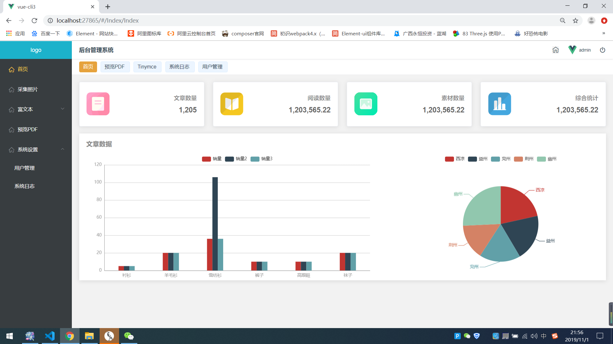
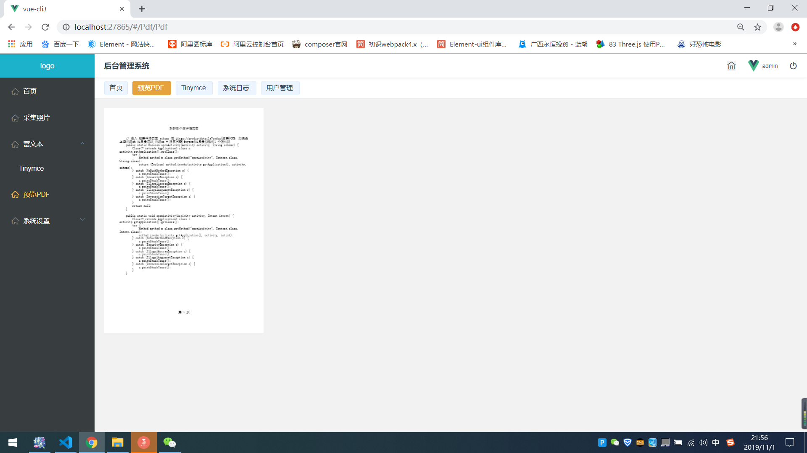
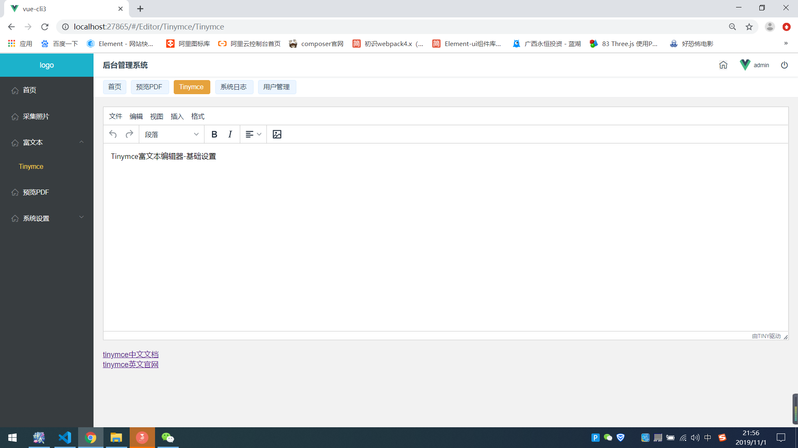
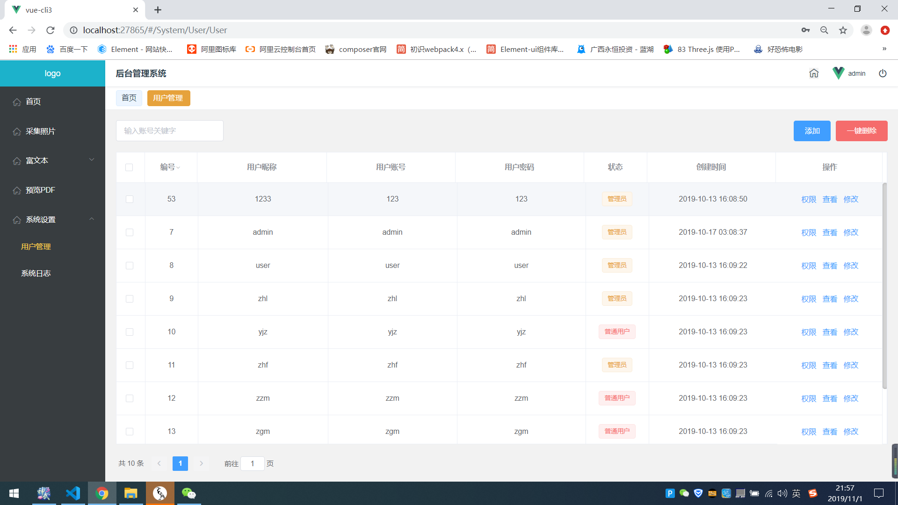
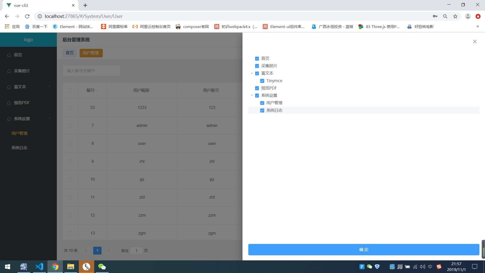

# vue-cli3

## 项目截图








## 开启项目
```
yarn install
```
### Compiles and hot-reloads for development
```
yarn run serve
```
### Compiles and minifies for production
```
yarn run build
```

### Customize configuration
See [Configuration Reference](https://cli.vuejs.org/config/).

## 项目插件

1. vue-router
2. vuex
3. less
4. element.ui
5. vue-pdf
6. driver.js
7. tinymce

## 项目要点

1. jwt鉴权
2. 根据用户权限动态生成路由
3. 根据axios封装请求拦截和响应拦截及loading
4. driver.js 引导页 (有bug)
5. Tinymce富文本
6. 预览pdf

## 脚手架版本

*vue-cli-3.0

#### 由于域名在备案中,暂无线上预览地址 需要数据库以及TP6.0后端代码的call我

## 项目中的问题
1. props 接收一个Number类型时会提示
解决：npm install --save core-js   yarn add core-js@2.6.9 --save

2. 解决vuex刷新数据丢失(安装持久化插件，原理利用浏览器自带存储库来保存数据)
npm install vuex-persistedstate --save

3. 打包之后 空白页面(资源加载错误)
添加一个 vue.config.js(可选配置,详情查看官网)
module.exports = {
  publicPath: './',
  outputDir: 'dist',
  assetsDir: 'static'
}

4. 切换用户之后旧的路由未清除

export function resetRouter () {
  const newRouter = createRouter()
  router.matcher = newRouter.matcher
}
